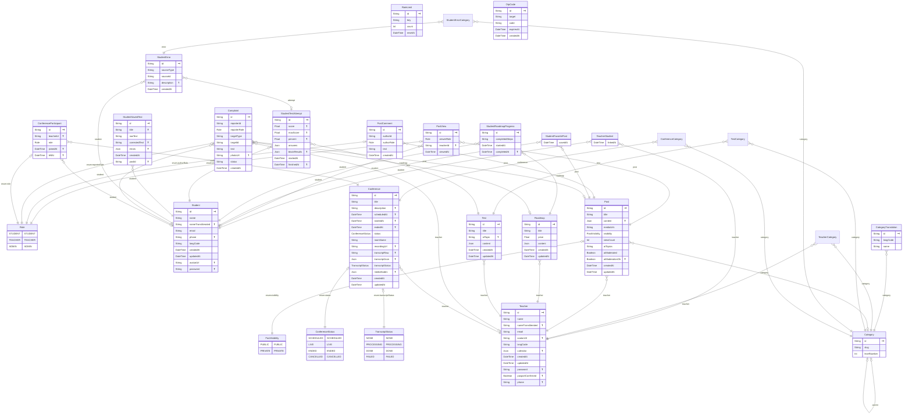

```mermaid
erDiagram

        Role {
            STUDENT STUDENT
TEACHER TEACHER
ADMIN ADMIN
        }
    


        PostVisibility {
            PUBLIC PUBLIC
PRIVATE PRIVATE
        }
    


        ConferenceStatus {
            SCHEDULED SCHEDULED
LIVE LIVE
ENDED ENDED
CANCELLED CANCELLED
        }
    


        TranscriptStatus {
            NONE NONE
PROCESSING PROCESSING
DONE DONE
FAILED FAILED
        }
    
  "RateLimit" {
    String id "🗝️"
    String key 
    Int count 
    DateTime resetAt 
    }
  

  "Student" {
    String id "🗝️"
    String name 
    String nameTransliterated "❓"
    String email 
    String phone "❓"
    String langCode 
    DateTime createdAt 
    DateTime updatedAt 
    String avatarUrl "❓"
    String password "❓"
    }
  

  "Teacher" {
    String id "🗝️"
    String name 
    String nameTransliterated "❓"
    String email 
    String avatarUrl "❓"
    String langCode 
    Json calendar "❓"
    DateTime createdAt 
    DateTime updatedAt 
    String password "❓"
    Boolean pasportConfirmed "❓"
    String phone "❓"
    }
  

  "TeacherStudent" {
    DateTime linkedAt 
    }
  

  "Category" {
    String id "🗝️"
    String slug 
    Int levelNumber 
    }
  

  "CategoryTranslation" {
    String id "🗝️"
    String langCode 
    String name 
    }
  

  "TeacherCategory" {

    }
  

  "Post" {
    String id "🗝️"
    String title 
    Json content "❓"
    String mediaUrls 
    PostVisibility visibility 
    Int viewCount 
    String aiTopics 
    Boolean aiModerated 
    Boolean aiModerationOk "❓"
    DateTime createdAt 
    DateTime updatedAt 
    }
  

  "PostView" {
    String id "🗝️"
    Role viewerRole 
    String teacherId "❓"
    DateTime viewedAt 
    }
  

  "PostComment" {
    String id "🗝️"
    String authorId 
    Role authorRole 
    String text 
    DateTime createdAt 
    }
  

  "StudentFavoritePost" {
    DateTime savedAt 
    }
  

  "Roadmap" {
    String id "🗝️"
    String title 
    Float price 
    Json content 
    DateTime createdAt 
    DateTime updatedAt 
    }
  

  "StudentRoadmapProgress" {
    String id "🗝️"
    String completedSteps 
    DateTime startedAt 
    DateTime completedAt "❓"
    }
  

  "Test" {
    String id "🗝️"
    String title 
    String aiTopic "❓"
    Json content 
    DateTime createdAt 
    DateTime updatedAt 
    }
  

  "TestCategory" {

    }
  

  "StudentTestAttempt" {
    String id "🗝️"
    Float score "❓"
    Float maxScore "❓"
    Float percent "❓"
    Json answers 
    Json blockResults "❓"
    DateTime startedAt 
    DateTime finishedAt "❓"
    }
  

  "StudentSavedText" {
    String id "🗝️"
    String title "❓"
    String rawText 
    String correctedText "❓"
    Json errors "❓"
    DateTime createdAt 
    String postId "❓"
    }
  

  "StudentError" {
    String id "🗝️"
    String sourceType 
    String sourceId 
    String description "❓"
    DateTime createdAt 
    }
  

  "StudentErrorCategory" {

    }
  

  "Complaint" {
    String id "🗝️"
    String reporterId 
    Role reporterRole 
    String targetType 
    String targetId 
    String text 
    String photoUrl "❓"
    String status 
    DateTime createdAt 
    }
  

  "OtpCode" {
    String id "🗝️"
    String target 
    String code 
    DateTime expiresAt 
    DateTime createdAt 
    }
  

  "Conference" {
    String id "🗝️"
    String title 
    String description "❓"
    DateTime scheduledAt "❓"
    DateTime startedAt "❓"
    DateTime endedAt "❓"
    ConferenceStatus status 
    String roomName 
    String recordingUrl "❓"
    String transcriptRaw "❓"
    Json transcriptJson "❓"
    TranscriptStatus transcriptStatus 
    Json mediaNodes "❓"
    DateTime createdAt 
    DateTime updatedAt 
    }
  

  "ConferenceCategory" {

    }
  

  "ConferenceParticipant" {
    String id "🗝️"
    String teacherId "❓"
    Role role 
    DateTime joinedAt "❓"
    DateTime leftAt "❓"
    }
  
    "TeacherStudent" }o--|| "Student" : "student"
    "TeacherStudent" }o--|| "Teacher" : "teacher"
    "Category" |o--|o "Category" : "parent"
    "CategoryTranslation" }o--|| "Category" : "category"
    "TeacherCategory" }o--|| "Category" : "category"
    "TeacherCategory" }o--|| "Teacher" : "teacher"
    "Post" |o--|| "PostVisibility" : "enum:visibility"
    "Post" }o--|o "Category" : "category"
    "Post" }o--|| "Teacher" : "teacher"
    "PostView" |o--|| "Role" : "enum:viewerRole"
    "PostView" }o--|| "Post" : "post"
    "PostView" }o--|o "Student" : "student"
    "PostComment" |o--|| "Role" : "enum:authorRole"
    "PostComment" }o--|| "Post" : "post"
    "StudentFavoritePost" }o--|| "Post" : "post"
    "StudentFavoritePost" }o--|| "Student" : "student"
    "Roadmap" }o--|| "Teacher" : "teacher"
    "StudentRoadmapProgress" }o--|| "Roadmap" : "roadmap"
    "StudentRoadmapProgress" }o--|| "Student" : "student"
    "Test" }o--|| "Teacher" : "teacher"
    "TestCategory" }o--|| "Category" : "category"
    "TestCategory" }o--|| "Test" : "test"
    "StudentTestAttempt" }o--|| "Student" : "student"
    "StudentTestAttempt" }o--|| "Test" : "test"
    "StudentSavedText" }o--|| "Student" : "student"
    "StudentError" }o--|o "StudentTestAttempt" : "attempt"
    "StudentError" }o--|| "Student" : "student"
    "StudentErrorCategory" }o--|| "Category" : "category"
    "StudentErrorCategory" }o--|| "StudentError" : "error"
    "Complaint" |o--|| "Role" : "enum:reporterRole"
    "Complaint" }o--|o "Post" : "post"
    "Complaint" }o--|o "Roadmap" : "roadmap"
    "Complaint" }o--|o "Student" : "student"
    "Complaint" }o--|o "Teacher" : "teacher"
    "Conference" |o--|| "ConferenceStatus" : "enum:status"
    "Conference" |o--|| "TranscriptStatus" : "enum:transcriptStatus"
    "Conference" }o--|| "Teacher" : "teacher"
    "ConferenceCategory" }o--|| "Category" : "category"
    "ConferenceCategory" }o--|| "Conference" : "conference"
    "ConferenceParticipant" |o--|| "Role" : "enum:role"
    "ConferenceParticipant" }o--|| "Conference" : "conference"
    "ConferenceParticipant" }o--|o "Student" : "student"
```
